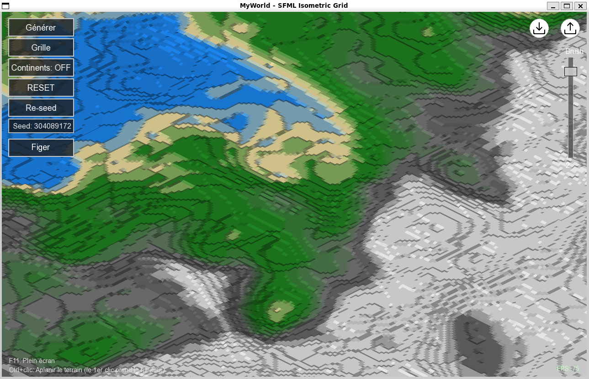

# SFML-MyWorld

Un éditeur/visualiseur de terrain isométrique en C++/SFML.

- Rendu isométrique avec ombres optionnelles et shading par normale.
- Édition de la carte par brosse (hausse/baisse/plat).
- Import/export CSV progressif (non-bloquant).
- UI simple: boutons Générer, Grille, Import/Export.

## Structure du projet

- `src/main.cpp` — boucle principale, UI, entrées clavier/souris, import/export CSV.
- `src/render.cpp`, `src/render.hpp` — projection 2D, wireframe, remplissage des cellules, shading/ombres.
- `src/iso.cpp`, `src/iso.hpp` — projection/déprojection isométrique paramétrable (`IsoParams`).
- `src/terrain.cpp` — génération procédurale (`terrain::generateMap`).
- `src/config.hpp` — constantes globales (taille de grille, fenêtre, bornes d’élévation, etc.).
- `assets/` — ressources (police `arial.ttf`, icônes import/export).
- `Makefile` — build multi-plateforme (Windows/Unix), cibles utiles.

## Prérequis

- SFML 2.6.1 (ou compatible). Sous Windows, chemin par défaut: `C:\SFML-2.6.1`.
- MinGW-w64 (g++). Sous MSYS2: `C:\msys64\mingw64`.
- GNU Make.

Le `Makefile` détecte automatiquement:

- `SFML_INC`, `SFML_LIB`, `SFML_BIN`
- `MINGW_BIN` (pour packager les DLLs)

Ajustez les variables en haut du `Makefile` si vos chemins diffèrent, ou exportez des variables d’environnement correspondantes.

## Construire et lancer

Windows (par défaut du projet):

```bat
make rebuild
make run
```

- `rebuild` nettoie et recompile dans `build/`, lie vers `bin/game.exe`.
- `run` ajoute `SFML_BIN` et `MINGW_BIN` au PATH et lance `bin/game.exe`.

Unix (Linux/macOS avec SFML installé):

```sh
make
make run
```

## Cibles Make utiles

- `make build` — compile sans nettoyer.
- `make rebuild` — nettoie et recompile.
- `make run` — exécute l’appli.
- `make clean` — supprime `build/` et `bin/`.
- `make package` — copie `assets/` et les DLLs SFML/MinGW dans `bin/` pour redistribution.

## Contrôles

- **Souris**
  - Molette: zoom in/out.
  - Bouton du milieu: drag pour panner la vue.
  - Clic gauche: peindre pour **augmenter** l’élévation dans le rayon de la brosse.
  - Clic droit: peindre pour **diminuer** l’élévation.
  - Drag droit (en dehors de l’édition) : rotation (X) et tilt (Y) de la projection.
- **Clavier**
  - `G`: générer un nouveau terrain aléatoire.
  - `F2`: activer/désactiver les ombres.
  - `F3`: afficher/masquer la grille (wireframe).
  - `R`: réinitialiser la caméra/projection (45°, pitch 1) et recentrer.
  - `W/A/S/D` ou flèches: pan de la vue.

Note: Un mode "aplatissement" de la brosse est disponible dans le code (plat à une hauteur cible) et s’active depuis l’UI; il agit sur la zone circulaire de la brosse.

## Import/Export CSV

- **Boutons** (en haut à droite):
  - Export: ouvre une boite de dialogue, écrit un CSV de `(GRID+1) x (GRID+1)` hauteurs.
  - Import: charge progressivement (quelques lignes par frame) pour éviter les saccades.
- Fichiers d’exemple: `map01.csv`, `map02.csv`, `map03.csv` à la racine.

Format: chaque ligne du CSV contient `GRID+1` entiers séparés par `,`, bornés par `cfg::MIN_ELEV..cfg::MAX_ELEV`.

## Détails de rendu

- Projection isométrique contrôlée par `IsoParams` (`rotDeg`, `pitch`).
- Shading Lambertien approximé via normale de cellule.
- Ombres projetées en 2D par marche discrète le long de la direction de la lumière (masque plein-grille).

## État des optimisations

- Les tentatives de cache de projection et de culling par fenêtre visible ont été **revertées** suite à des bugs rencontrés.
- Version actuelle: rendu et masque d’ombres sur l’ensemble de la grille à chaque frame (état stable).
- Pistes futures (à réintroduire prudemment):
  - Cache `map2d` avec invalidation sur édition/import/génération/changement d’iso.
  - Culling des boucles de remplissage/ombres via fenêtre d’indices dérivée de la vue.
  - Réutilisation de `sf::VertexArray` avec `reserve()` pour limiter les allocations.

## Dépannage

- Si l’exécutable ne démarre pas sous Windows, vérifiez que les DLLs de SFML et MinGW sont bien trouvées:
  - Utilisez `make package` pour copier automatiquement les DLLs dans `bin/`.
  - Assurez-vous que `SFML_BIN` et `MINGW_BIN` sont corrects (voir messages Makefile au build).
- Avertissement `NOMINMAX redefined`: sans conséquence (défini par l’outilchain et dans `main.cpp`).

## Capture d’écran



Vue sur une carte d’example.

## Licence

Projet éducatif. Droits des assets/images selon leurs licences respectives.
